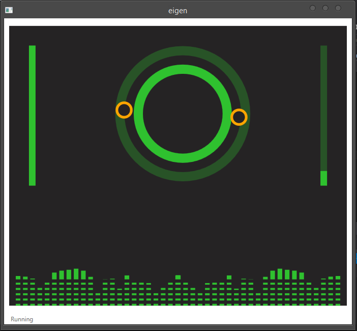

# eigen

Live Audio Mixing with Kinect.

**eigen** allows users to mix audio with live compositions on the fly with hand gestures.

## Screen

## Quick Start

- Setup [pygame](http://www.lfd.uci.edu/~gohlke/pythonlibs/#pygame) and [flask](http://flask.pocoo.org/)
- Start flask music server `python server.py`
- Run Kinect solution

---

24-hour Hack made during Microsoft **code.fun.do** IIT Roorkee 2015 by team **Lapse Jumpers**.
